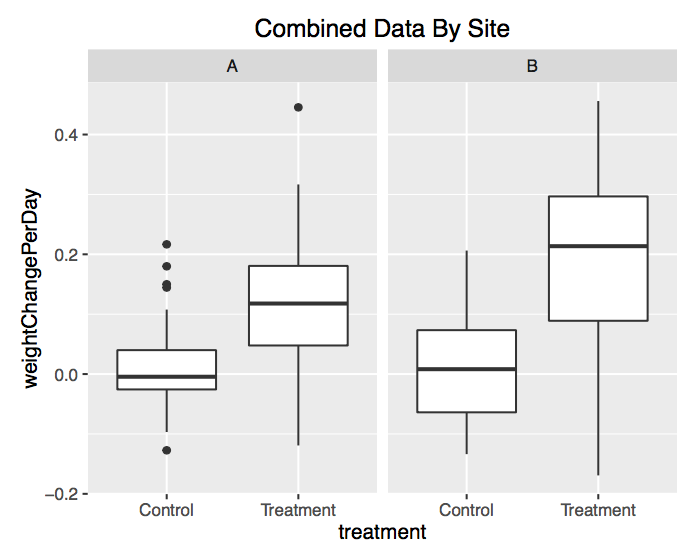

## Question

How many of you are involved in helping students use data?

## What are the issues we've encountered with PhD students?

- What is the appropriate research question?
- How do we present the data and tell a story?
- What are the ethical issues with reusing data?
- How do we assess the quality of a dataset?

## Training Modules/Workshops that address these issues

- What is the appropriate research question for a dataset?
    - [Data After Dark Workshop](https://dmice.ohsu.edu/bd2k/skillscourse/Jan2016Schedule.html)
- How do we present the data and tell a story?
    - [Visualization and Interpretation](https://github.com/OHSUBD2K/BDK18-Data-Visualization)
- What are the ethical issues with using data?
    - [Ethical Issues in the Use of Big Data](https://github.com/OHSUBD2K/BDK03-Ethical-Issues-in-Use-of-Big-Data)
- How do we assess the quality of a dataset?
    - [Exploratory Data Analysis Workshop](https://github.com/laderast/shinyEDA)

All materials are freely available as Open Educational Resources!

http://github.com/OHSUBD2K

## Exploring Data Quality Workshop

Can we combine data from two different sites for a single weight loss study?

https://github.com/laderast/shinyEDA

## Acknowledgements

OHSU Big Data to Knowledge (BD2K) Training team:

- Bill Hersh
- David Dorr
- Melissa Haendel
- Shannon McWeeney
- Nicole Vasilevsky
- Jackie Wirz
- Bjorn Pedersen

BD2K Training Grant: 1R25EB020379-01

## We love collaboration!

- These slides: http://laderast.github.io/data-sci-resources/
- Resources: http://github.com/OHSUBD2K

Open invitation to use and extend these materials!

- laderast@ohsu.edu
- @tladeras
- https://laderast.github.io
- BioData Club: https://biodata-club.github.io
